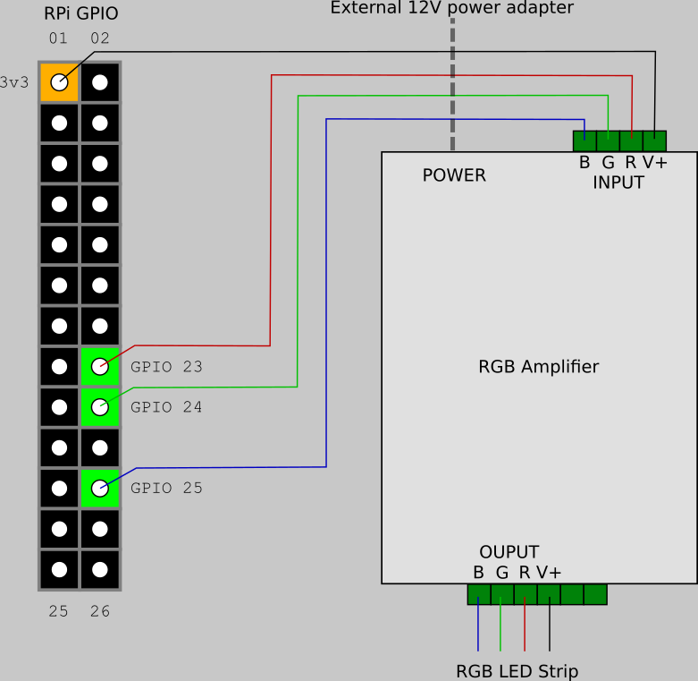
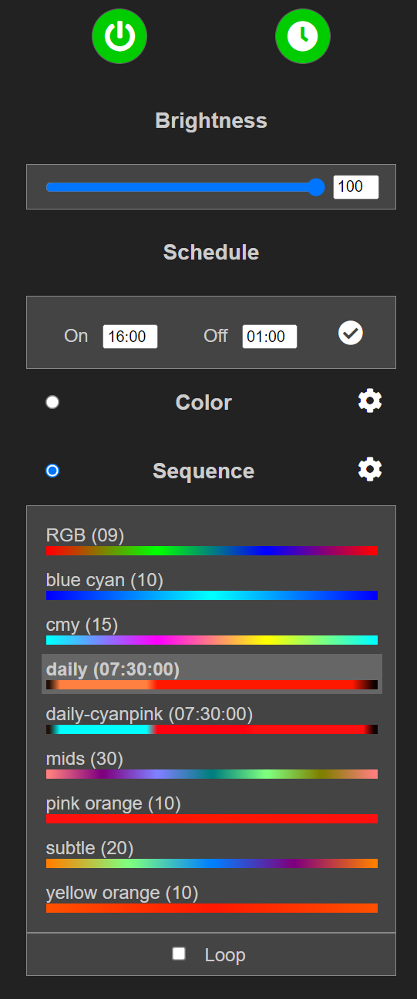

# RGB Strip controller for Raspberry Pi

This app allows you to control an RGB strip, connected to your Raspberry Pi through GPIO, from a web browser. On Chrome for Android, specifically, you can create a shortcut to the controller page on your home screen, and use it like any other RGB controller app.

This app was inspired by [this article](https://www.instructables.com/id/Easiest-RGB-LED-Strip-With-Raspberry-Pi/) on Instructables.

## How does it work?

This is a `Flask` application, that uses the `pigpio` library, to set GPIO signals to control a connected RGB LED strip. An RGB amplifier is used to convert the 3.3V GPIO signals to 12V as required by a 5050 RGB strip.

Although this app has only been tested with a 12V strip, with an appropriate amplifier or circuit, this may even work with 5V strips.

## Setting it up

Here, we assume that you already have Raspbian (or a compatible OS) installed on a Raspberry Pi (henceforth, RPi or Pi for short) and you have a working network connection on the RPi, ideally, with a static IP address. Additionally, you will need to know how to edit text files on your RPi and, either have a keyboard and display hooked up to your RPi while you set it up, or know how to connect to it over the network via SSH. All of this information is readily available online.

If you intend to run only this app on your RPi, the Lite image on a RPi Zero, should suffice.

The following instructions assume that the red, green and blue channels are being controlled by GPIO23, GPIO24 and GPIO25, respectively. Please make adjustments, as appropriate for your environment.

### Hardware connections

The pin layout shown here is for a 1st generation RPi. Please check the layout for your version, before connecting.



### Software
Get to the command prompt on your RPi (direct login or SSH).

Install the prerequisites
```
sudo apt-get install pigpiod pigpio-tools python3 python3-pigpio python3-flask git
```
Start the `pigpiod` daemon
```
sudo systemctl daemon-reload
sudo service pigpiod start
```
Make sure pigpio works (use the correct GPIO IDs)
```
pigs pwm 23 0 pwm 24 0 pwm 25 0
```
You should now see your led strip light up white. If the above command does nothing, or tells you that the `pigpiod` daemon is not running, please see the [Troubleshooting](#troubleshooting) section below.

Turn the LEDs off with:
```
pigs pwm 23 255 pwm 24 255 pwm 25 255
```
Set the `pigpiod` daemon to start automatically on boot.
```
sudo update-rc.d pigpiod enable
```
Determine the LAN IP address of your RPi and note it down. For simplicity, we will refer to this IP address as `<Pi_IP_Address>`, where required.
```
hostname -I
```
Clone this repository
```
git clone --recurse-submodules https://github.com/singhaxn/rgb-app.git
```
Navigate into your app folder
```
cd rgb-app
```
See the [App Configuration](#app-configuration) section below and make any changes that may be required for your environment.

Edit `rgb-app.service` and replace `/home/pi/src/rgb-app`, with the correct absolute path to your copy of this repository, under `WorkingDirectory` and `ExecStart`.

Copy the service file into `/etc/systemd/system`
```
sudo cp rgb-app.service /etc/systemd/system/
```
Start the service
```
sudo systemctl daemon-reload
sudo service rgb-app start
```

In a web browser, on any device on your local network (same network as the RPi), open the page `http://<Pi_IP_Address>:5000/`. Press the power button. The LED strip should turn on white and you should see a page similar to this:



If not, see the [Troubleshooting](#troubleshooting) section below.

To get the RGB app to start up automatically at boot, add the following line to your `/etc/rc.local`, before the `exit 0` line.
```
service rgb-app start
```

## App Configuration

The default app configuration is stored in `settings/default.json`, inside your clone of this repository. The first time you run the app, these settings are copied over to the live configuration file, `settings/rgb.json`. If you ever want to revert back to the default settings, simply delete `settings/rgb.json`. This section describes modifications to `settings/rgb.json`. However, the same description applies to `settings/default.json` when `settings/rgb.json` __does not exist__.

If you do need to edit the live configuration file, remember to stop the `rgb-app` service first:
```
sudo service rgb-app stop
```
and start it up again afterwards
```
sudo service rgb-app start
```

### Common Modifications
1. Specify the correct IP address of your Pi under `bind-addr`. Ideally, this should be a static IP address. The default address is set to `127.0.0.1` which will be accessible only if your browser is running on the RPi itself.
2. If you want to use a different port, specify it under `bind-port`. For simplicity, the default port number `5000` is used in these instructions.
3. If you're using different pins than the default GPIO23, GPIO24 and GPIO25 for the red, green and blue channels, respectively, specify the correct GPIO IDs under `pins`. The sequence is `[R, G, B]`. Please note that these are GPIO ids and not physical pin numbers.

## Troubleshooting
1. ### `pigs` does not work
In my case, I discovered that the `pigpiod` server was listening on the default ipv6 address instead of ipv4. I got it to work by modifying `ExecStart` line in the `pigpiod` service definition in `/lib/systemd/system/pigpiod.service` to
```
ExecStart=/usr/bin/pigpiod -l -n 127.0.0.1
```
Optionally, depending on your use case, you may want to change the sampling rate to reduce processor usage:
```
ExecStart=/usr/bin/pigpiod -l -n 127.0.0.1 -s 10
```
Restart the `pigpiod` service and try to turn the strip on again.

2. ### `http://<Pi_IP_Address>:5000/` returns an `ERR_CONNECTION_REFUSED` error
Make sure, the correct bind address is specified in the configuration file, as described in the [App Configuration](#app-configuration) section above.

3. ### `pigs` works but you can't control your LED strip from the web interface
 - Make sure, the correct GPIO pin IDs are specified in the configuration file, as described in the [App Configuration](#app-configuration) section above.
 - Check whether __Schedule__ is enabled in the web interface. If so, then the LED strip will only turn on when specified in the schedule. Disable __Schedule__ if you want to control the lights manually.
 - Make sure __Brightness__ is not set too low on the web interface.
 - Make sure __Color__ is not set to `[0, 0, 0]` on the web interface.

4. ### LED Colors are wrong
Do not expect the color reproduction of your RGB LED strips to be accurate with respect to the colors you see on your screen. Each LED strip is likely to have a different calibration. This is why only red, green, blue and white presets are provided by default. Still, make sure, the correct GPIO pin IDs are specified in the configuration file, as described in the [App Configuration](#app-configuration) section above.
